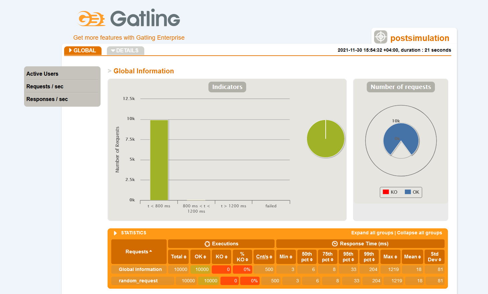

# Load test results 3

Results of the third load testing that involves 500 requests per second during 20 seconds:

## Test environment specifications
###### OS
Windows 10 Pro 21H1
###### Processor
Intel(R) Core(TM) i7-8750H CPU @ 2.20GHz 2.21 GHz
###### RAM
32.0 GB